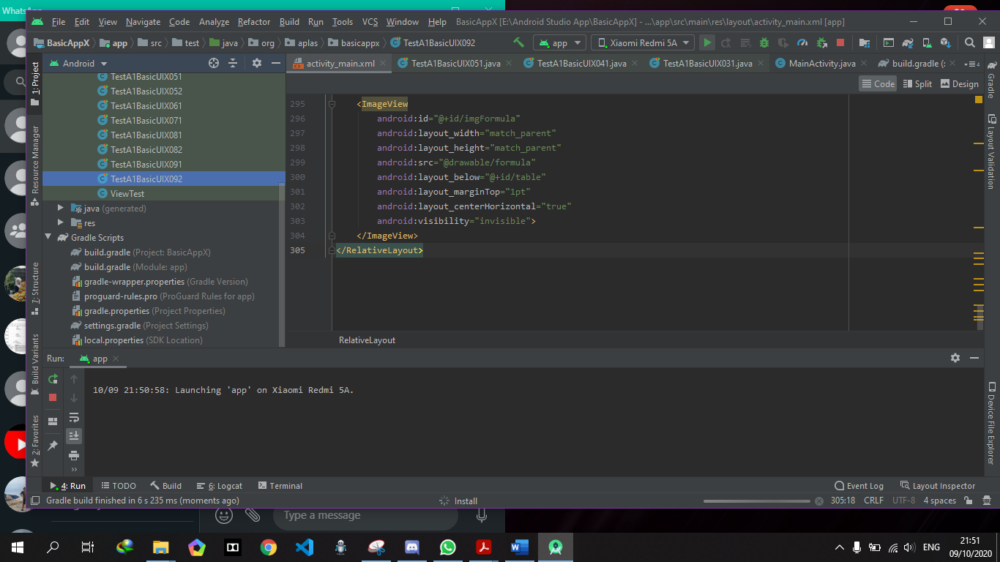
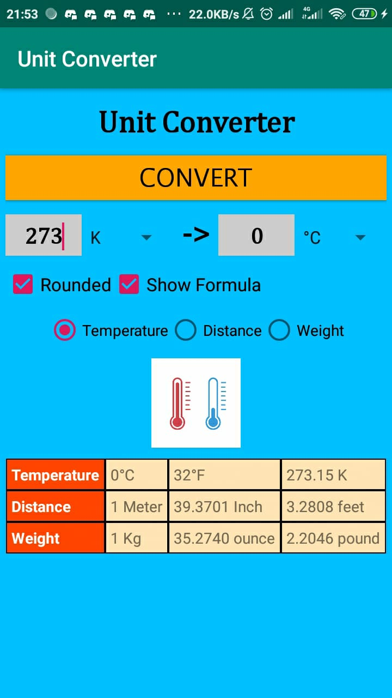

# 02 - Layout

## Tujuan Pembelajaran

1.	Mahasiswa memahami konsep layout pada android.

2.	Mahasiswa memahami konsep View Group dan Hierarchy pada layout.

3.	Mahasiswa mampu membuat layout
sederhana.

4.  Mahasiswa menguasai layout editor dan kegunaannya pada android studio.

## Hasil Praktikum
Link untuk source code nya, ada disini :

[activity_main.xml](../../src/02_layout/ForAPLAS/activity_main.xml)

[AndroidManifest.xml](../../src/02_layout/ForAPLAS/AndroidManifest.xml)

[cell_style](../../src/02_layout/ForAPLAS/cell_style.xml)

[colors.xml](../../src/02_layout/ForAPLAS/colors.xml)

[header_style](../../src/02_layout/ForAPLAS/header_style.xml)

[MainActivity.java](../../src/02_layout/ForAPLAS/MainActivity.java)

[strings.xml](../../src/02_layout/ForAPLAS/strings.xml)

[styles.xml](../../src/02_layout/ForAPLAS/styles.xml)

Screenshot Output nya diaplikasikan melalui Perangkat atau Device Asli (bukan Emulator dari Android Studio) :

